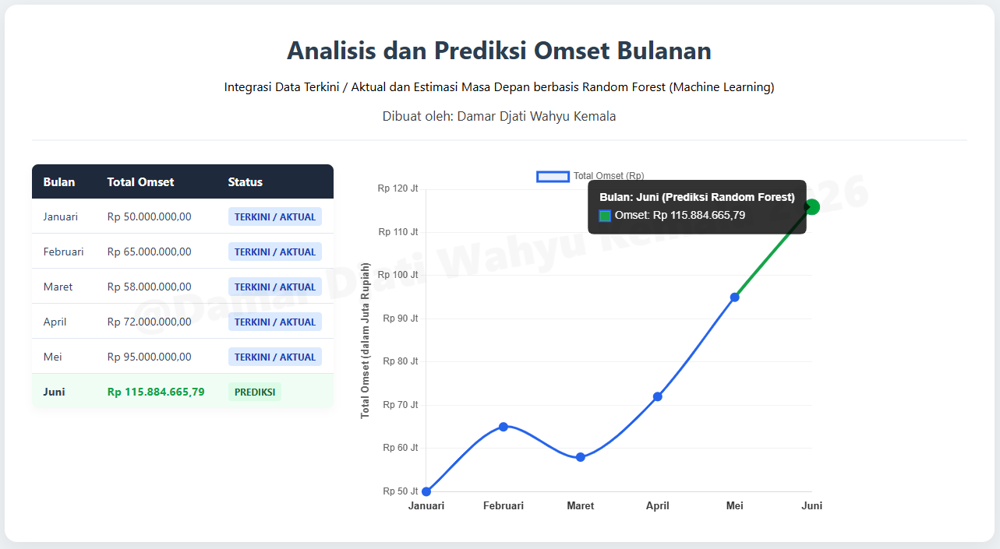
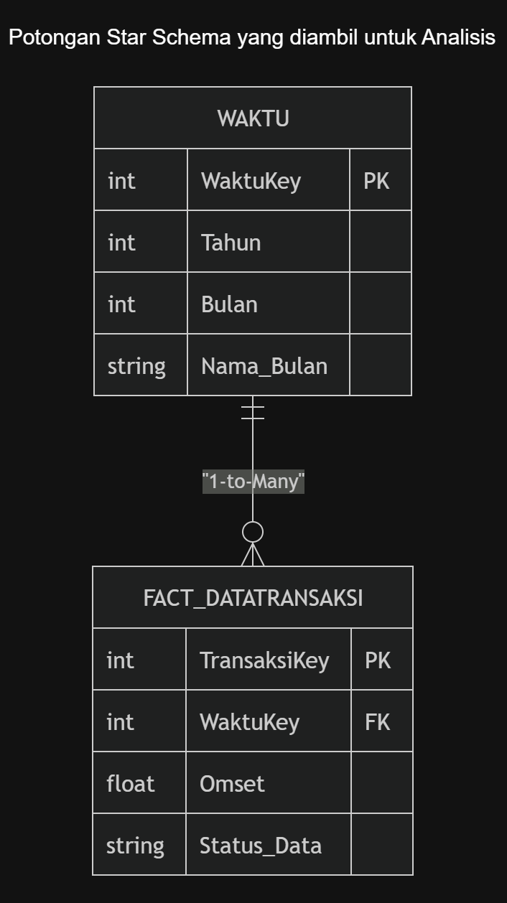

<div align="center">
  <h3>DATA ANALYST & BUSINESS ANALYST PORTFOLIO</h3>
  <h2>Omset Analysis dan ML Prediction Dashboard</h2>
  <p><b>Created by:</b> Damar Djati Wahyu Kemala | <b>Role:</b> Aspiring Data & Business Analyst (Ex-SIMRS Developer)</p>
  <p><i>© 2026 Damar Djati Wahyu Kemala</i></p>
  <hr />
</div>


# Prologue

Sebuah sistem *data pipeline* terintegrasi untuk melakukan analisis tren omset bulanan (Januari - Mei) dan melakukan prediksi omset masa depan (Juni) menggunakan Machine Learning. Data disajikan secara *real-time* dalam bentuk dashboard interaktif berbasis web.

---

## Fitur
* **ML Forecasting:** Prediksi otomatis omset bulan Juni menggunakan Python (*Linear Regression / Machine Learning*).
* **Star Schema Data Warehouse:** Penyimpanan data menggunakan SQL Server dengan tabel fakta (`Fact_DataTransaksi`) dan dimensi (`WAKTU`).
* **High-Performance Backend:** REST API yang dibangun menggunakan bahasa **Go (Golang)**.
* **Interactive BI Dashboard:** Visualisasi data menggunakan **Chart.js** dengan fitur pemisahan warna otomatis untuk data aktual / terkini (Biru) dan data prediksi (Hijau).

---

## Tech Stack


* **Database:** Microsoft SQL Server
* **AI/Data Science:** Python 3 (Pandas, Scikit-Learn, `pyodbc`/`pymssql`)
* **Backend API:** Go 1.20+ (Driver: `github.com/microsoft/go-mssqldb`)
* **Frontend:** HTML5, CSS3 (Flexbox Layout), dan Chart.js

---

## Struktur Project

```text
Linear-Regression-Sistem-Prediksi-Harga-Penjualan-Barang
├── index.html               # Frontend Dashboard (Tabel dan Chart.js)
├── .gitignore
├── go.mod
├── go.sum
├── hasil-data-omset-dari-api.png
├── index.html
├── main.go                  # Backend server Golang (REST API)
└── model_prediksi.py        # Linear Regression dan insert data prediksi omset     
```
---

## View Dashboard dan Potongan Star Skema SQL





---

## Copyright Personal Portfolio
* **Project Owner / Created By:** Damar Djati Wahyu Kemala
* **Role:** Aspiring Data Analyst & Business Analyst (Ex-SIMRS Developer)
* **Date Created:** Juni 2026
* **GitHub Portfolio:** [https://github.com/dams-code](https://github.com/dams-code)

---
*© 2026 Damar Djati Wahyu Kemala. This project is a part of my professional data analyst portfolio. Authorization is required for commercial use or modification.*